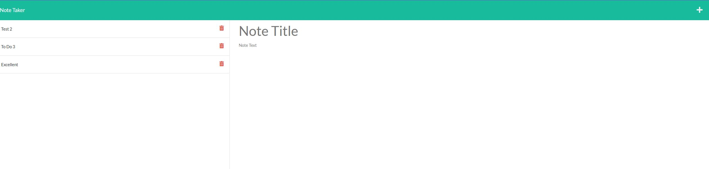

# note-taker

## Description

This project is to be used as a program that allows a user to take notes and save them to the webpage as well as delete the note once it is completed.

Live application: https://powerful-garden-67682.herokuapp.com/notes

Github Repo: https://github.com/richiethie/note-taker 

## Table of Contents

- [Installation](#installation)
- [Usage](#usage)
- [License](#license)
- [How to Contribute](#how-to-contribute)

## Installation

You will need to install express in order to run the back end of this application.

## Usage

Attached below is a screenshot of the home page of this application. The usage is fairly simple. To start typing a new note, the user will click on the plus and then into the note title and create the title, and also click into the note text to create the text of the note. After the note contents are written, a save button will appear in the top right corner. The user can click this button and that will save the note to the left sidebar where the title of that note will be displayed in a list with other saved notes. Finally, a user can also delete any saved notes by clicking on the red garbage can.

## License

MIT License

Copyright (c) 2022 Richie Thiesfeldt

Permission is hereby granted, free of charge, to any person obtaining a copy
of this software and associated documentation files (the "Software"), to deal
in the Software without restriction, including without limitation the rights
to use, copy, modify, merge, publish, distribute, sublicense, and/or sell
copies of the Software, and to permit persons to whom the Software is
furnished to do so, subject to the following conditions:

The above copyright notice and this permission notice shall be included in all
copies or substantial portions of the Software.

THE SOFTWARE IS PROVIDED "AS IS", WITHOUT WARRANTY OF ANY KIND, EXPRESS OR
IMPLIED, INCLUDING BUT NOT LIMITED TO THE WARRANTIES OF MERCHANTABILITY,
FITNESS FOR A PARTICULAR PURPOSE AND NONINFRINGEMENT. IN NO EVENT SHALL THE
AUTHORS OR COPYRIGHT HOLDERS BE LIABLE FOR ANY CLAIM, DAMAGES OR OTHER
LIABILITY, WHETHER IN AN ACTION OF CONTRACT, TORT OR OTHERWISE, ARISING FROM,
OUT OF OR IN CONNECTION WITH THE SOFTWARE OR THE USE OR OTHER DEALINGS IN THE
SOFTWARE.

## How to Contribute

If you would like to contribute anything to this application feel free to contact me at richiethie@gmail.com

